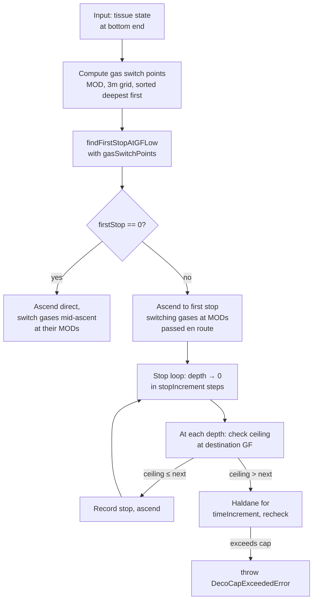

# Algo-04 — Deco Stop Loop

From the first stop inward to the surface, produce the list of mandatory stops: depth, duration, controlling gas. This is the main body of `generateDecoSchedule`.

## Entry point

```javascript
// js/decoModel.js:826 (signature)
export function generateDecoSchedule(tissuePressures, currentDepth, n2Fraction, gfLow, gfHigh, gases = null, options = {})
```

`options.surfacePressure` controls the surface target, pressure-to-depth
conversion, GF endpoint, MOD shift, and stop grid for altitude dives.

Returns:

```javascript
{
  stops: [{ depth: 9, time: 3, gas: 'Air' }, ...],
  gasSwitches: [{ depth: 21, gas: 'EAN50', gasId: 2 }, ...],
  totalTime: 18.2,          // minutes: ascent + stops
  totalAscentTime: 5.5,     // minutes spent moving (not stopped)
  pAnchor: 2.40,            // bar
  anchorDepth: 13.9         // meters
}
```

Two modes are selected by `options.continuousDeco`:

```javascript
// js/decoModel.js:900-904
const { switchPpO2 = 1.6, continuousDeco = false, gasSwitchTime = 0 } = options;
const stopIncrement = continuousDeco ? 0.1 : STOP_INCREMENT;  // 3 m default
const timeIncrement = continuousDeco ? 0.1 : 1;                // 1 min default
```

Standard mode produces a 3 m / 1 min staircase matching decotengu and dive-computer output. Continuous mode (0.1 m / 0.1 min) is for educational visualization — the dive profile renders as a smooth curve instead of steps.

## High-level flow



## Gas-switch points

```javascript
// js/decoModel.js:922-952
const gasSwitchPoints = [];
if (gases && gases.length > 1) {
    for (const gas of gases.slice(1)) {
        if (!gas.o2 || gas.o2 <= 0 || !Number.isFinite(gas.o2)) continue;
        if (!Number.isFinite(gas.n2) || gas.n2 < 0 || gas.n2 > 1) continue;
        if (gas.o2 + gas.n2 > 1.001) continue;
        const mod = (switchPpO2 / gas.o2 - 1) * 10;
        if (!Number.isFinite(mod)) continue;
        const switchDepth = Math.max(0, Math.floor(mod / stopIncrement) * stopIncrement);
        gasSwitchPoints.push({ ...gas, switchDepth });
    }
    gasSwitchPoints.sort((a, b) => b.switchDepth - a.switchDepth);
}
```

The result is an array of deco gases, each annotated with a `switchDepth` on the 3 m grid, sorted deepest first. This is the canonical form passed into `findFirstStopAtGFLow` and the stop loop.

## Ascent to first stop, with mid-ascent switches

The ascent to the first stop is not a single Schreiner segment — it is split at every gas-switch depth that falls between `currentDepth` and `firstStopDepth`. This matters for richer deco gases whose MODs lie above the first stop; e.g., air bottom + EAN50, dive to 40 m, first stop at 12 m — EAN50 gets switched in at 21 m, so the 40 → 21 m and 21 → 12 m segments use different $f_{N_2}$.

```javascript
// js/decoModel.js:1044-1074
const ascentSwitchDepths = [...new Set(gasSwitchPoints.map(g => g.switchDepth))]
    .filter(d => d < depth && d >= firstStopDepth)
    .sort((a, b) => b - a);  // deepest first

let currentAscentDepth = depth;
let currentTissues = { ...tissues };

for (const switchDepth of ascentSwitchDepths) {
    if (currentAscentDepth > switchDepth) {
        const segmentTime = (currentAscentDepth - switchDepth) / ASCENT_SPEED;
        currentTissues = simulateDepthChange(currentTissues, currentAscentDepth, switchDepth, segmentTime, currentN2);
        totalAscentTime += segmentTime;
        currentAscentDepth = switchDepth;
        if (switchToBestGas(switchDepth) && gasSwitchTime > 0) {
            currentTissues = simulateDepthTime(currentTissues, switchDepth, gasSwitchTime, currentN2);
            stops.push({ depth: switchDepth, time: gasSwitchTime, gas: currentGasName });
        }
    }
}

if (currentAscentDepth > firstStopDepth) {
    const finalSegmentTime = (currentAscentDepth - firstStopDepth) / ASCENT_SPEED;
    currentTissues = simulateDepthChange(currentTissues, currentAscentDepth, firstStopDepth, finalSegmentTime, currentN2);
    totalAscentTime += finalSegmentTime;
}
```

## The stop loop

```javascript
// js/decoModel.js:1081-1132
const MIN_STOP_TIME = continuousDeco ? 2 : 0;
let pendingStopTime = 0;

while (depth > 0) {
    if (switchToBestGas(depth) && gasSwitchTime > 0) {
        tissues = simulateDepthTime(tissues, depth, gasSwitchTime, currentN2);
        pendingStopTime += gasSwitchTime;
    }

    const nextStopDepth = Math.max(0, Math.round((depth - stopIncrement) * 10) / 10);
    const delta = depth - nextStopDepth;
    const ascentTime = delta / ASCENT_SPEED;

    // Can-we-ascend check uses GF at the *destination* depth.
    const gfThere = interpolateGF(getAmbientPressure(nextStopDepth), pAnchor, gfLow, gfHigh);
    const { ceilingDepth } = getDiveCeiling(tissues, gfThere);

    if (ceilingDepth <= nextStopDepth) {
        if (pendingStopTime > 0) {
            if (continuousDeco && pendingStopTime < MIN_STOP_TIME) {
                const extra = MIN_STOP_TIME - pendingStopTime;
                tissues = simulateDepthTime(tissues, depth, extra, currentN2);
                pendingStopTime = MIN_STOP_TIME;
            }
            stops.push({
                depth: Math.round(depth * 10) / 10,
                time: Math.round(pendingStopTime * 10) / 10,
                gas: currentGasName
            });
            pendingStopTime = 0;
        }
        tissues = simulateDepthChange(tissues, depth, nextStopDepth, ascentTime, currentN2);
        totalAscentTime += ascentTime;
        depth = nextStopDepth;
    } else {
        tissues = simulateDepthTime(tissues, depth, timeIncrement, currentN2);
        pendingStopTime = Math.round((pendingStopTime + timeIncrement) * 10) / 10;

        if (pendingStopTime > DECO_STOP_MAX_MINUTES) {
            throw new DecoCapExceededError(depth, stops, DECO_STOP_MAX_MINUTES);
        }
    }
}
```

Per-iteration logic:

- Compute the GF at the **destination** depth (one step shallower than current). The ramp gives a higher GF as the diver moves toward the surface, so the destination GF is the relevant constraint for "can I move there now?".
- If the dive ceiling under the destination GF clears `nextStopDepth`, ascend (no Schreiner off-gassing credit is applied to the short inter-stop ascent itself). Otherwise wait `timeIncrement` minutes at depth (Haldane) and re-test.
- Stops are only recorded if `pendingStopTime > 0` — a stop that the diver merely passes through without waiting does not appear in the list. This is why the first recorded stop can be shallower than `anchorDepth`.

## Safety cap

```javascript
// js/decoModel.js:42
export const DECO_STOP_MAX_MINUTES = 300;
```

If a single stop exceeds 300 min, `DecoCapExceededError` is thrown (`js/decoModel.js:48-61`). This is the algorithm's way of flagging "this profile is outside the usable domain" — typically the GF is too aggressive for the exposure, or the chosen gas cannot off-gas this tissue fast enough. Callers should surface the error rather than present a silently-truncated plan.

## Worked example

40 m air + EAN50 deco, 25 min bottom, $GF = 30/85$.

- Gas switch points: EAN50 MOD at $\mathrm{ppO_2} = 1.6$ → 22 m → `switchDepth = 21 m`.
- `pAnchor ≈ 2.40 bar` (14 m), first stop at 15 m (3 m grid).
- Ascent 40 → 21 m on air, switch to EAN50, 21 → 15 m on EAN50. First stop at 15 m on EAN50 (since 15 ≤ 21).
- Stop loop from 15 m: typical result around
  - 15 m: 1 min
  - 12 m: 1 min
  - 9 m: 3 min
  - 6 m: 5 min
  - 3 m: 9 min
  - total deco ≈ 19 min, totalTime ≈ 22 min (ascent + stops).

Stop durations grow as the controlling compartment shifts toward slower tissues (TC5 → TC7 → TC9 …). The numbers here are indicative — exact values depend on descent profile and gas-switch timing.

## Cross-references

- [Algo-03-First-Stop-Ramped-GF](Algo-03-First-Stop-Ramped-GF.md) — the `pAnchor` and first-stop inputs.
- [Algo-05-Multi-Gas-Switching](Algo-05-Multi-Gas-Switching.md) — how `gasSwitchPoints` and `switchToBestGas` pick gases.
- [Model-05-Gradient-Factors](Model-05-Gradient-Factors.md) — the `interpolateGF` ramp the loop calls on every iteration.
- [References](References.md#41-decotengu-primary-reference-implementation) — stop-termination follows decotengu's convention; the 3900-scenario cross-check passes 100 % within ±5 min, mean diff 0.6 min.
