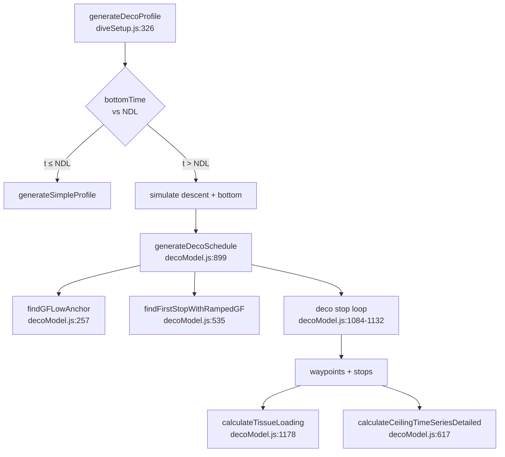

# Algorithms

The orchestration layer that strings together the Haldane / Schreiner equations, Bühlmann M-values, and the Baker gradient-factor ramp into a working dive simulator. The [[Decompression-Model]] chapters cover the underlying equations; this section is about how those equations are *called* to produce a dive plan.

## Pipeline

1. The user provides a dive setup: bottom gas + optional deco gases, $GF_{low}$ / $GF_{high}$, and either a full waypoint array or just `{maxDepth, bottomTime}`.
2. `generateDecoProfile(maxDepth, bottomTime, gases, gfLow, gfHigh, …)` (`js/diveSetup.js:326`) is the top-level entry. It calls `calculateNDL()` first; if $t_{bottom} \le NDL$ it returns a simple no-stop profile. Otherwise it simulates descent + bottom time to get tissue state, then hands off to `generateDecoSchedule()`.
3. `generateDecoSchedule()` (`js/decoModel.js:899`) computes gas-switch MODs, calls `findGFLowAnchor()` to get `pAnchor`, calls `findFirstStopWithRampedGF()` to place the first stop, then runs the deco loop to generate the stop list.
4. Output is a waypoint array (embedded stops + gas switches) plus metadata (total deco time, controlling compartment, `pAnchor`, `anchorDepth`).
5. Chart rendering replays the waypoints at 10-second resolution via `calculateTissueLoading()` (`js/decoModel.js:1178`) and overlays per-timepoint ceilings via `calculateCeilingTimeSeriesDetailed()` (`js/decoModel.js:617`).

The pipeline is single-pass per dive setup: tissue state flows forward from surface, `pAnchor` is computed once at ascent start and passed downstream to every function that needs a GF-ramp reference.

## Chapter TOC

1. [[Algo-01-Ascent-Simulation]] — replay a waypoint array over all 16 compartments; segment dispatch between Haldane (level) and Schreiner (slope).
2. [[Algo-02-NDL-Calculation]] — binary search for no-decompression limit at a given depth and gas.
3. [[Algo-03-First-Stop-Ramped-GF]] — the two-step `pAnchor` → first-stop discovery. The subtlest chapter.
4. [[Algo-04-Deco-Stop-Loop]] — from first stop to surface, generate the stop list; the `DECO_STOP_MAX_MINUTES` safety cap.
5. [[Algo-05-Multi-Gas-Switching]] — MOD calculation, sequential switching, gas-switch waypoint insertion.
6. [[Algo-06-Ceiling-Time-Series]] — per-timepoint ceiling overlay for chart rendering.

Cross-cutting: [[Architecture]] for the module/function index; [[Decompression-Model]] for the equations themselves; [[References#11-decotengu-documentation--structure-and-rigor-to-match]] for the prior-art decotengu docs whose structure these chapters mirror.
