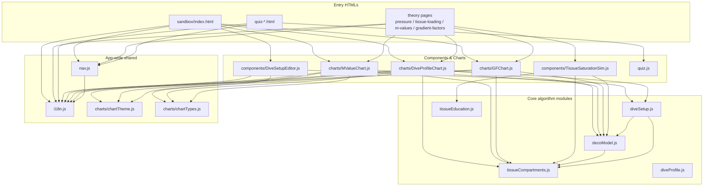

DecoJS is a vanilla-JavaScript Progressive Web App with no build pipeline. The browser loads ES modules directly from source, and every `.js` file in the repo is exactly the file the browser parses. This page covers the high-level shape; per-file details live in [[Module-Reference]].

## No-build ES-module philosophy

There is no bundler, no transpiler, no TypeScript compile step, no `dist/` directory. HTML files load entry modules with `<script type="module" src="...">` and the rest resolves through native `import` statements. Two consequences worth naming:

- **Imports use explicit relative paths with `.js` extensions** (e.g. `import { COMPARTMENTS } from './tissueCompartments.js'`). No bare-module resolution, no import maps, no path aliases.
- **Third-party libraries come from CDN `<script>` tags**, not npm. Chart.js, chartjs-plugin-annotation, Hammer.js, and chartjs-plugin-zoom are loaded from `cdn.jsdelivr.net` in the entry HTML; `node_modules/` exists only for Jest (used by an alternate test runner; the primary runner is dependency-free).

The rationale is educational transparency: a reader with a browser and a text editor can trace any value on screen back to the exact line of source that produced it, without sourcemaps, bundling artefacts, or a toolchain to stand up. It also makes the PWA's cache simple — the `STATIC_ASSETS` array in `sw.js` is the literal list of files served.

## Three sections, three entry families

The app is split into three user-facing sections, defined by `NAV_ITEMS` in `js/nav.js`:

| Section | Count | Entry HTML files | Primary modules |
|---|---|---|---|
| **Sandbox** | 5 simulators | `sandbox/index.html`, `sandbox/tissue-saturation.html`, `sandbox/transfilling.html`, `sandbox/cascade-filling.html`, `sandbox/gas-law.html` | `DiveSetupEditor` + `DiveProfileChart` + `MValueChart` + `GFChart` (main sandbox); specialised simulators for the rest |
| **Theory** | 4 lessons | `pressure.html`, `tissue-loading.html`, `m-values.html`, `gradient-factors.html` | Embed chart components with canned setups; `TissueSaturationSim`, `StickyTOC`, `HeroMotion` for page chrome |
| **Tests** | 7 quizzes | `quiz-physics.html`, `quiz-anatomy.html`, `quiz-accidents.html`, `quiz-safety.html`, `quiz-training.html`, `quiz-equipment.html`, `quiz-vessel.html` | Generic `quiz.js` engine + per-topic JSON in `data/quiz-*.json` |

The landing (`index.html`) and `about.html` sit outside these groups.

## Module dependency graph

All imports are static (no dynamic `import()` calls) and the graph is acyclic. The core has four shared modules used across sections; the Sandbox-only chart and editor components layer on top.



Observations:

- **`decoModel.js` and `tissueCompartments.js` are the two universal-core modules** — every chart pulls from them.
- **`diveSetup.js` depends on `decoModel.js`** (it calls `calculateNDL`, `generateDecoSchedule`, `simulateDepthTime`, etc.), so importing `diveSetup` pulls in the whole algorithm.
- **`diveProfile.js` is standalone** — parsing and validation only, no algorithm imports.
- **Nothing imports `quiz.js` except quiz pages** — the quiz subsystem is cleanly isolated from the deco algorithm.

## Rendering: Chart.js on Canvas

All three algorithm charts — `DiveProfileChart`, `MValueChart`, `GFChart` — use the same rendering stack:

- **Chart.js v3+** on **HTML5 Canvas** (not SVG). One `<canvas>` per chart instance; Chart.js owns the pixel buffer and redraws on every `chart.update()`.
- **chartjs-plugin-annotation** for M-value lines, pAnchor markers, deco stop annotations, and gas switch markers.
- **Hammer.js + chartjs-plugin-zoom** for pinch/pan/wheel interaction. Double-click resets zoom; a lock button (`js/charts/interactionLock.js`) toggles interaction on for mobile.
- **`chartTheme.js`** reads CSS custom properties from `:root` and applies them as Chart.js defaults — typography, grid colors, legend styling. Idempotent; called before every render and on theme toggle.
- **`chartTypes.js`** centralises dive-setup validation and normalisation (`validateDiveSetup`, `normalizeDiveSetup`, `mergeOptions`). No runtime types — just schema-style validation.

All CDN scripts are loaded in the entry HTML, not imported by modules, so the algorithm core remains Chart.js-free and is directly unit-testable under Node.

## PWA: service worker and manifest

The service worker is 150 lines, dependency-free, and uses a **cache-first-with-network-fallback** strategy.

```javascript
// sw.js:2
const CACHE_NAME = 'deco-theory-0.5.48';
```

- **`STATIC_ASSETS`** (sw.js starting at line 5) lists 70 entries: HTML pages, JS modules, CSS, WOFF2 fonts, SVG icons, locale JSON, and data JSON (`data/dive-*.json`, `data/quiz-*.json`). Notably absent: `sandbox/chart-test.html`, `sandbox/gas-law.html`, and `test*.html` — deliberately excluded.
- **`install`** pre-caches `STATIC_ASSETS` into the cache keyed by `CACHE_NAME`.
- **`activate`** deletes any other cache bucket whose key is not the current `CACHE_NAME`. Combined with `skipWaiting()` and `clients.claim()`, this means new versions silently take over from old SW — no user prompt, no "click to update" banner; the next page reload serves fresh content.
- **`fetch`** tries the cache first; on miss, fetches from the network and caches any 200 OK response.

`manifest.json` declares a standalone PWA (no browser chrome) with `start_url: "/decojs/index.html"`, `scope: "/decojs/"`, 8 SVG icons (72px to 512px including a maskable variant), theme color `#2980b9`, and categories `["education", "health"]`.

The `CACHE_NAME` bump is load-bearing — it is the only mechanism that forces installed PWAs to pick up new content. This is why [[Project-Info#before-every-commit]] requires a version bump in `sw.js` on every release.

## i18n

Custom JSON-based loader — no i18next, no framework. Three languages ship (`locales/en.json`, `locales/cs.json`, `locales/es.json`): theory pages default to English, quizzes default to Czech (SPČR source material).

- `js/i18n.js` fetches the current locale bundle, exposes a `translate(key, params)` function, and wires a language switcher into the nav.
- On user language change it dispatches a global **`languagechange`** event.
- Every component that renders text listens for `languagechange` and re-renders — chart axis labels, legend, tooltips, DiveSetupEditor form labels, nav links, quiz question bodies.

## Event model

Components extend the native `EventTarget` and communicate via DOM-style custom events — no pub/sub library, no store, no framework state.

The canonical flow:

1. User edits a field in `DiveSetupEditor`.
2. The editor serialises its form to a `diveSetup` object and emits `change` with `detail.diveSetup` (if `emitOnInput === true`, every keystroke; otherwise on blur).
3. Each chart listens on the editor instance: `editor.addEventListener('change', e => chart.update(e.detail.diveSetup))`.
4. `update()` re-validates through `chartTypes.js`, recomputes tissue loading and ceiling via `decoModel.js`, rebuilds Chart.js datasets, and calls `chart.update()`.

The same pattern carries `languagechange` (global on `window`) and theme toggles. No component reaches into another's internals; all cross-component state moves through events or through the `diveSetup` object itself.

Per-file details live in [[Module-Reference]].
